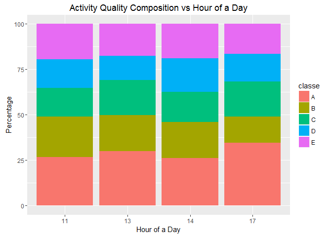
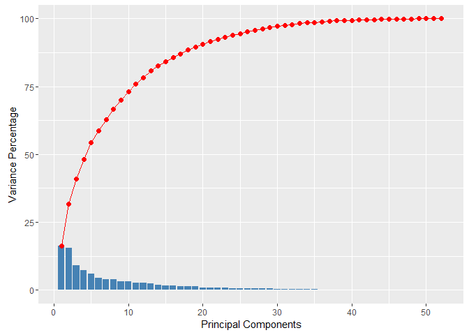
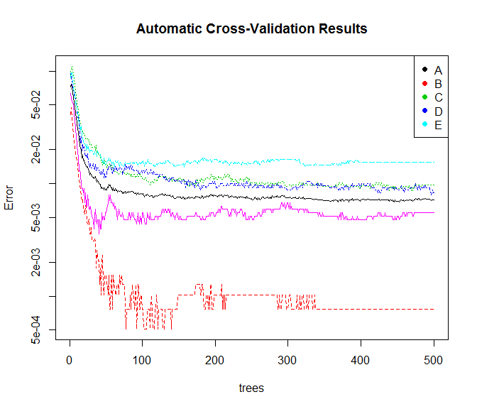
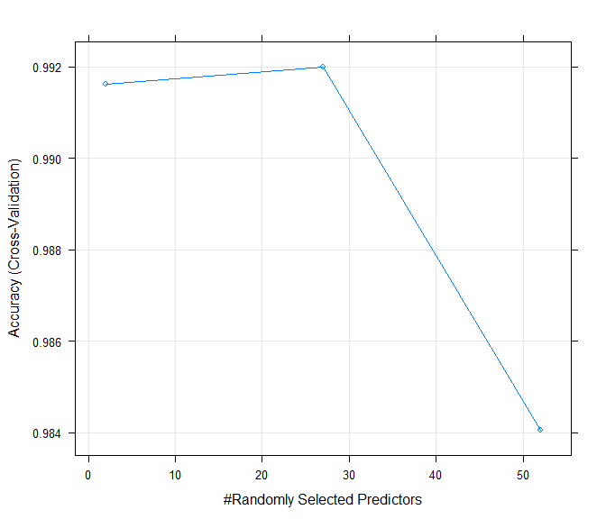
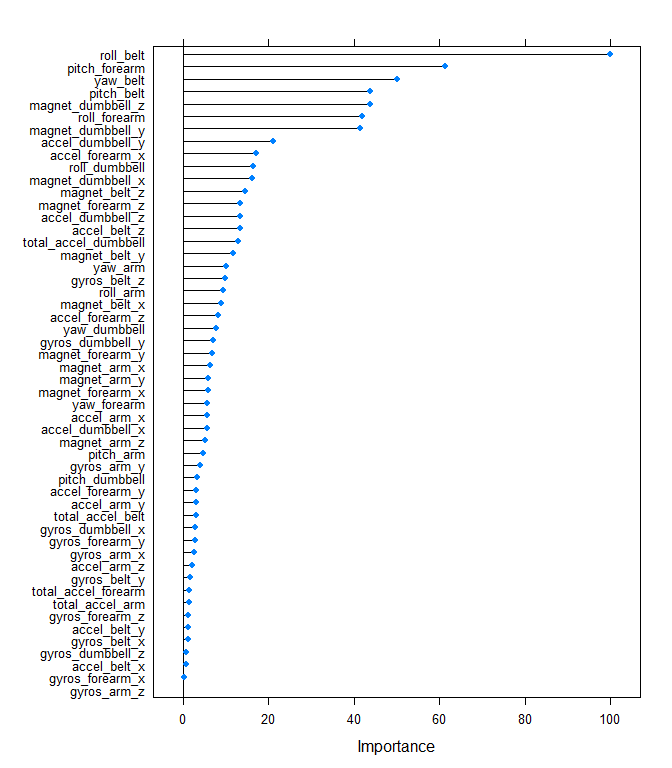

# Personal Activity Monitor Analysis
By Nithya  
&nbsp;

#Executive Summary

Now a days people are using several sensors to read how much (quantitatively) of a particular physical activity they are doing. Such sensor data is easily obtainable. But what this raw data lacks is a qualitative insight into how "well" an activity was performed. 

The analysis in this Document intends to achieve the above. We use a set of accelerometer readings on the belt, forearm, arm and dumbell obtained from 6 participants doing barebell lifting. They were asked to perform barbell lifts correctly and incorrectly in 5 different ways. The outcome of accelerometers was then recorded and classified for their quality by assigning an ordinal variable with range A to E.

&nbsp;

#Approach

The Training Dataset ([Link to Training DS][1]) used has 19622 observations and 160 variables. The outcome (the one we need to predict) is stored in a variable named "classe". We would need to do the below with the datset - 

1. Divide it with a proportion of 70%:30% into Training and Validation Data sets.

2. Build the model on the Training data set containing 70% of actual number of observations.

3. Validate the model on Validation data set containing 30% of observations in order to cross-validate to find the out of sample error. 

Once we have concluded on the predictive model using the above steps, we would apply the same on the test dataset ([Link to Testing DS][2]) and predict the results.

&nbsp;

#Type of Model 

This is essentially a classification requirement. We need to classify or rank an activity-instance/-attempt on a scale of A to E via a concise and accurate model. We would make use of descision trees which would take the designated inputs and predict the results. 

**To benefit from the strength of bootstrapping for selecting a model for this classification requirement, we would use the Random Forest method.**

&nbsp;

#Data Retrieval, Cleansing and Preprocessing


```r
library(knitr)
library(lubridate)
library(ggplot2)
library(gridExtra)
library(caret)
library(parallel)
library(doParallel)
library(randomForest)
```

&nbsp;

##Data Retieval
We would first load the datasets from the web urls containing the Training and Validation datasets.


```r
download.file(url = "https://d396qusza40orc.cloudfront.net/predmachlearn/pml-training.csv", destfile = "pml-training.csv")
act_data <- read.csv("pml-training.csv")

download.file(url = "https://d396qusza40orc.cloudfront.net/predmachlearn/pml-testing.csv", destfile = "pml-testing.csv")
testing <- read.csv("pml-testing.csv")
```

*Data Collection*: The abstract provided at the link - [Abstract][3], describes the data collection and classification Process (process of classifying the sensor readings of each record on a quality scale of A to E) in detail.

**About the Data**

1. Each row contains a distinct set of sensor readings taken at a given time instance.

2. We would be prediciting the outcome stored in the variable named "classe"

3. There are variables for calculated features on the "Euler angles (roll, pitch and yaw)", "total acceleration", "gyros x/y/z", "acceleration x/y/z" and "magnet x/y/z" for each of the 4 sensors - "Belt", "Arm", "Forearm" and "Dumbell".

4. There are some timeseries variables in the begining that indicate the 2.5sec windows for collection of sensor readings.

5. There are a few apparently derived attributes which mostly are either NA or Blank. 

&nbsp;

##Data Cleansing

**1. User Names and Serial Numbers:**

We are not interested in how a person is performing. We only want to know how well a particular execution of activity is based on the sensor reading irrespective of any person. Therefore, we can drop the user name column from model selection process. Also we would drop Serial Number which does not convey any information.


```r
final_data <- act_data[,c(-1,-2)]
testing_final <- testing[,c(-1,-2)]
```

**2. Time Series Data:**

The columns 3 to 7 are time series variables. This data pertains to the time windows for which the Sensor readings were obtained. We choose to exclude them from the prediction algorithm due to the below reasons - 

1. This is an incremental time series and we can not build a generic classification model (like random forest) by including the same. 

2. Eventhough via some other exploratory analysis on these datasets, it may appear that the timeseries data should be included (we may get slightly better prediction accuracy as well for these specific datasets), this may result in overfitting in general. 

3. The variables, new_window and num_window can be ignored as they are consolidation columns and not measured variables in true sense. 

4. Let us assume that there could be some influence of the hour of a day when the readings were taken (people may feel more active in the morning than evening or vice versa). We will now verify this assumption via the below graph where we have plotted the activity quality in cumulative %age against the hours.


```r
final_data$cvtd_timestamp <- strptime(as.character(act_data$cvtd_timestamp),"%d/%m/%Y %H:%M")
testing_final$cvtd_timestamp <- strptime(as.character(testing$cvtd_timestamp),"%d/%m/%Y %H:%M")

hour <- hour(as.character(final_data$cvtd_timestamp))
time_data <- data.frame(hr = hour, classe = final_data$classe, count = 1)
time_agg <- aggregate(x = time_data[ ,3], by = list(as.vector(time_data$hr), as.vector(time_data$classe)), FUN = "sum")
names(time_agg) <- c("hr", "classe", "count")
for(i in 1:nrow(time_agg)) { time_agg[i, "total"] <- sum(time_agg[time_agg$hr == time_agg[i, "hr"], "count"]) }
time_agg$percentage <- ifelse(time_agg$total != 0, (time_agg$count *100 / time_agg$total), 0)

g1 <- ggplot(data = time_agg,aes(x=as.character(hr))) + geom_bar(aes(y = percentage, fill = classe), stat='identity') + xlab("Hour of a Day") + ylab("Percentage") + ggtitle("Activity Quality Composition vs Hour of a Day") 
print(g1)
```

\

There doesnt seem to be any obvious pattern that indicates the influence of the hour of a day on activity quality. 

Based on all of the above justifications, we choose to drop all the time series variables.


```r
final_data <- act_data[,c(-1,-2,-3,-4,-5,-6,-7)]
testing_final <- testing[,c(-1,-2,-3,-4,-5,-6,-7)]
```

**3. NA and Blank Columns:**

As we can see, there are several rows with most/all of the values as NAs or Blanks. This could be due to various reasons, investigating which is out of scope of our analysis now. These variables can not be considered for model selection. We would now filter out the variable which are NAs / Blanks for more than 75% of the rows.


```r
indx1 <- ifelse(colSums(is.na(final_data) / nrow(final_data)) < 0.75, T, F)
final_data <- final_data[,indx1]
testing_final <- testing_final[,indx1]

indx2 <- ifelse(colSums((final_data == "") / nrow(final_data)) < 0.75, T, F)
final_data <- final_data[,indx2]
testing_final <- testing_final[,indx2]
```

After the above preprocessing and filtering, below are the **Final set of Columns we would base our prediction model on** - 


```r
names(final_data)
```

```
##  [1] "roll_belt"            "pitch_belt"           "yaw_belt"            
##  [4] "total_accel_belt"     "gyros_belt_x"         "gyros_belt_y"        
##  [7] "gyros_belt_z"         "accel_belt_x"         "accel_belt_y"        
## [10] "accel_belt_z"         "magnet_belt_x"        "magnet_belt_y"       
## [13] "magnet_belt_z"        "roll_arm"             "pitch_arm"           
## [16] "yaw_arm"              "total_accel_arm"      "gyros_arm_x"         
## [19] "gyros_arm_y"          "gyros_arm_z"          "accel_arm_x"         
## [22] "accel_arm_y"          "accel_arm_z"          "magnet_arm_x"        
## [25] "magnet_arm_y"         "magnet_arm_z"         "roll_dumbbell"       
## [28] "pitch_dumbbell"       "yaw_dumbbell"         "total_accel_dumbbell"
## [31] "gyros_dumbbell_x"     "gyros_dumbbell_y"     "gyros_dumbbell_z"    
## [34] "accel_dumbbell_x"     "accel_dumbbell_y"     "accel_dumbbell_z"    
## [37] "magnet_dumbbell_x"    "magnet_dumbbell_y"    "magnet_dumbbell_z"   
## [40] "roll_forearm"         "pitch_forearm"        "yaw_forearm"         
## [43] "total_accel_forearm"  "gyros_forearm_x"      "gyros_forearm_y"     
## [46] "gyros_forearm_z"      "accel_forearm_x"      "accel_forearm_y"     
## [49] "accel_forearm_z"      "magnet_forearm_x"     "magnet_forearm_y"    
## [52] "magnet_forearm_z"     "classe"
```

&nbsp;

##Data Partitioning


```r
set.seed(33433)
inTrain <- createDataPartition(final_data$classe, p = 0.7, list = FALSE)
training <- final_data[inTrain, ]
validation <- final_data[-inTrain, ]
```

&nbsp;

##Pre-Processing: Principal Component Analysis (PCA)

We would like to use Principal Component Analysis to find the components that capture majority of the variances in Training dataset. 


```r
prcmp <- prcomp(training[,-ncol(training)], center = TRUE, scale. = TRUE)
pc <- data.frame(var <- (prcmp$sdev)^2)
names(pc) <- "Var"
pc$perc <- pc$Var * 100 / sum(pc$Var)
pc$cum <- cumsum(pc$Var)
pc$cum_perc <- cumsum(pc$perc)
pc$pc <- 1:nrow(pc)
```

The below graph shows the outcome of PCA - 

1. Line Graph: Cumulative percentages of variance explained by the components

2. Bars: Variances explained by individual components. 


```r
g2 <- ggplot(data = pc) + geom_bar(aes(x = pc, y = perc, group = 1), stat = "identity", fill = "steelblue") + geom_point(aes(x = pc, y = cum_perc, group = 2), col = "red", size = 2) + geom_line(aes(x = pc, y = cum_perc, group = 2), col = "red") + xlab("Principal Components") + ylab("Variance Percentage")
print(g2)
```

\

As we can see, 90% of the variance can be explained by 20 components. While 95% of the variance can be explained by 25 components.

&nbsp;

#Model Selection

We would now fit a Random Forest Model on the training data set. Random Forest is an ensembel of several descision trees. It uses Bootstrapping technique to derive random samples of the training dataset do model each tree. Again using Bootstrapping, It would use a random set of variables for creating each model. At the end, all the individual trees would be merged / ensembeled and the predictions for each set of inputs would be averaged (majority vote) across the outcomes from these trees. Therefore, inspite of being a bit complicated, this model would give us the best accuracy.

We would also see if the Principal Component Analysis provides any improvement in accuracy. 

This model selection process being very perfomance intensive, we would go for parellel processing

##With outcome from PCA

```r
training_pca <- predict(prcmp, newdata = training)
cluster <- makeCluster(detectCores() - 1) 
registerDoParallel(cluster)
fitControl <- trainControl(method = "cv", number = 10, allowParallel = TRUE)
Model_Fit_pca <- train(training$classe~., data = training_pca, method = "rf", trControl = fitControl)
```

**Model Accuracy With outcome from PCA**

```r
results_pca <- Model_Fit_pca$results[order(-Model_Fit_pca$results[,2]), ]
kable(results_pca[1,], row.names = FALSE) 
```


 mtry    Accuracy       Kappa   AccuracySD     KappaSD
-----  ----------  ----------  -----------  ----------
    2   0.9773616   0.9713456    0.0049478   0.0062705

##Without outcome from PCA

```r
Model_Fit <- train(classe~., data = training, method = "rf", trControl = fitControl) 
stopCluster(cluster) 
```

**Model Accuracy Without outcome from PCA**

```r
results <- Model_Fit$results[order(-Model_Fit$results[,2]), ]
kable(results[1,], row.names = FALSE) 
```


 mtry    Accuracy       Kappa   AccuracySD     KappaSD
-----  ----------  ----------  -----------  ----------
   27   0.9919925   0.9898699    0.0012371   0.0015652

Below are the results of prediction (in %ages) without PCA.

```r
kable(confusionMatrix.train(Model_Fit)$table, align = "c", digits = 2)
```

        A        B        C        D        E   
---  -------  -------  -------  -------  -------
A     28.41    0.16     0.00     0.00     0.01  
B     0.01     19.14    0.11     0.02     0.01  
C     0.01     0.05     17.26    0.23     0.04  
D     0.00     0.00     0.07     16.12    0.06  
E     0.00     0.00     0.00     0.02     18.27 

**It is apparent from above that the model using PCA components only provides 97.74% accuracy. Comparitively the model that uses data without PCA, provides a better accuracy of 99.2%. Also the best tree model selected uses 27 randomly selected variables for prediction (mtry field)**

&nbsp;

#Cross Validation

We would now analyze the results of cross-validation of the prediction results using training dataset which R has performed for us automatically. Below are the results of the same without PCA. The Log of sample error has been plotted against the number of trees - 


```r
plot(Model_Fit$finalModel, log = "y", main = "Automatic Cross-Validation Results")
legend("topright", legend=unique(training$classe), col=unique(as.numeric(training$classe)), pch=19)
```

\

As we can see - 

1. The sample error decreases as more and more trees are ensembeled. 

2. The error rate becomes very flat (doesnt change much) after approx. 100 trees.

&nbsp;

Below we have plotted the overall Accuracy against the total count of randomly selected predictors. 


```r
plot(Model_Fit)
```

\

As we can see -

1. The accuracy remains between 99.15% to 99.2% for the number of randomly selected predictors from 2 to 27. 

2. The best accuracy if 99.2% is achieved at the count of 27

3. There is a sharp decline in accuracy with number of randomly selected predictors exceeding 27

&nbsp;

##Cross-Validation using the validation dataset

Let us now see how well our models (with and without PCA) perform on the validation dataset.

###With outcome from PCA

```r
validation_pca <- predict(prcmp, validation)
suppressMessages(cm1 <- confusionMatrix(validation$classe, predict(Model_Fit_pca, validation_pca)))
print(cm1$overall[1:4])
```

```
##      Accuracy         Kappa AccuracyLower AccuracyUpper 
##     0.9789295     0.9733388     0.9749289     0.9824449
```

###Without outcome from PCA

```r
suppressMessages(cm2 <- confusionMatrix(validation$classe, predict(Model_Fit, validation)))
print(cm2$overall[1:4])
```

```
##      Accuracy         Kappa AccuracyLower AccuracyUpper 
##     0.9925234     0.9905429     0.9899758     0.9945624
```

```r
kable(cm2$table, align = "c")
```

       A       B       C       D      E   
---  ------  ------  ------  -----  ------
A     1669     3       1       0      1   
B      5      1133     1       0      0   
C      0       4      1017     5      0   
D      0       1       15     947     1   
E      0       1       2       4     1075 

**As evident from above results, the PCA model provides 97.89% accuracy whereas the model that uses data without PCA, provides a better accuracy of 99.25%.**

**Looking at the above results, the Final Model selected would be the one without PCA.** 

Below are the 20 most important variables in the order of their influence with respect to the final model.


```r
plot(varImp(Model_Fit))
```

\

&nbsp;

##Out of Sample Error

**With the selected model, the out of sample error is : 0.0075 or 0.75%**

&nbsp;

#Applying the model on Testing Dataset

We would now go ahead and apply the model on the Testing Dataset with 20 observations with unique problem IDs available at - [Link to Testing DS][2]. 

**Below are the predictions for each of the problem IDs using the Random Forest model that we selected.**


```r
testing_final <- testing_final[,1:(ncol(testing_final)-1)]
testing_final$classe <- predict(Model_Fit, testing_final)
testing_final$problem_id <- testing$problem_id
kable(testing_final[,c("problem_id","classe")], align = "c", col.names = c("Problem ID on Testing Set", "Predicted Outcome"), caption = "Results of Prediction Model for Testing dataset")
```


Table: Results of Prediction Model for Testing dataset

 Problem ID on Testing Set    Predicted Outcome 
---------------------------  -------------------
             1                        B         
             2                        A         
             3                        B         
             4                        A         
             5                        A         
             6                        E         
             7                        D         
             8                        B         
             9                        A         
            10                        A         
            11                        B         
            12                        C         
            13                        B         
            14                        A         
            15                        E         
            16                        E         
            17                        A         
            18                        B         
            19                        B         
            20                        B         


[1]: https://d396qusza40orc.cloudfront.net/predmachlearn/pml-training.csv
[2]: https://d396qusza40orc.cloudfront.net/predmachlearn/pml-testing.csv
[3]: http://groupware.les.inf.puc-rio.br/har
